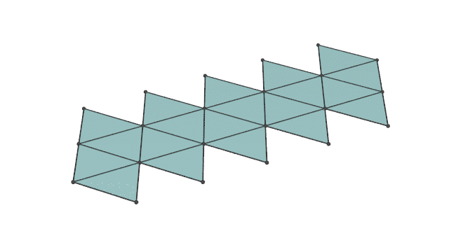
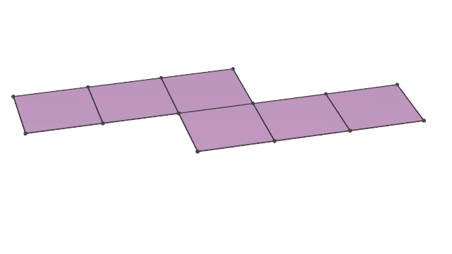

# JuliRay
POV-Ray wrapper for Julia language.

## Prerequire
* Julia (≥v1.4)
    * http://julialang.org
* povray engine
    * https://www.povray.org

## Examples

### Julia logo

### Platonic solids
    

### Net of cubes

### Net of regular polyhedra
    

    

### Net of regular polychora

### Sum of square numbers

### Paraboloid

### Isometric transformation between catenoid and helicoid
